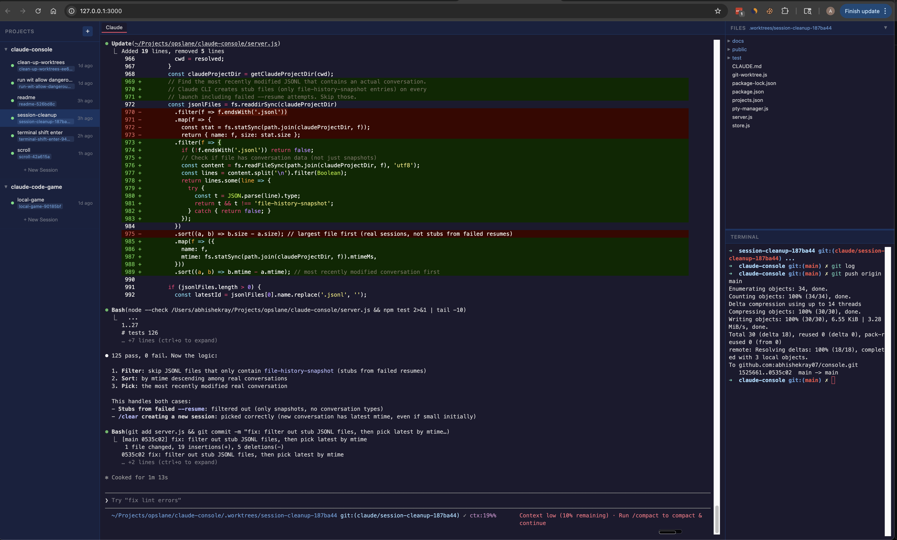

# Claude Console

A web-based multi-session manager for the Claude CLI. Run multiple Claude conversations in parallel, each isolated in its own git worktree.

<!-- TODO: Replace with actual screenshot of the UI with multiple sessions and file viewer open -->


## Features

- **Multiple sessions** — Run several Claude conversations side-by-side, each in its own terminal
- **Git worktree isolation** — Every session gets its own branch and worktree, so parallel experiments never conflict
- **File viewer** — Browse your project files, view code, and render markdown — without leaving the console
- **Integrated shell** — A separate terminal per session, running in the session's worktree
- **Session lifecycle** — Create, restart, archive, or delete sessions. Archive preserves the branch while cleaning up the worktree
- **Auto-reconnect** — WebSocket connections recover automatically with output replay, so you never lose context
- **Persistence** — Projects and sessions survive server restarts (SQLite-backed)
- **No build step** — Vanilla JS frontend, vendored dependencies, works offline

## Quick Start

```bash
git clone https://github.com/abhishekray07/console.git
cd console
npm install
npm start
```

Open [http://localhost:3000](http://localhost:3000) in your browser.

### Prerequisites

- Node.js 18+
- [Claude CLI](https://docs.anthropic.com/en/docs/claude-code) installed and authenticated
- A git repository with at least one commit (to manage sessions in)

## How It Works

Claude Console sits between you and the Claude CLI, managing multiple instances through a lightweight web UI.

```
Browser (xterm.js) ↔ WebSocket ↔ Express Server ↔ node-pty ↔ Claude CLI
```

- **Sessions** are spawned as PTY processes, giving you a full terminal experience in the browser
- **Git worktrees** isolate each session into its own branch (`claude/{name}-{uuid}`), so you can explore different approaches in parallel without conflicts
- **A ring buffer** (1MB per session) stores recent output, so reconnecting clients get immediate replay
- **SQLite** persists projects and sessions across server restarts

## Usage

### Projects

Add a git repository as a project from the sidebar. Each project can have multiple Claude sessions running independently.

### Sessions

- **Create** — Click "+" next to a project to start a new session. Each session gets its own git worktree and branch.
- **Restart** — Restarts a stopped session, resuming the Claude conversation where it left off.
- **Archive** — Keeps the branch but removes the worktree. Useful for preserving work without cluttering your filesystem.
- **Delete** — Removes the session, its worktree, and its branch entirely.

### File Viewer

Click any file in the right-panel tree to open it in a tab. Markdown files are rendered; code and text files display with plain text. Switch between the Claude terminal and open files using the tab bar.

### Keyboard Shortcuts

| Shortcut | Action |
|----------|--------|
| `Alt+Tab` | Cycle through tabs |
| `Alt+W` | Close current tab |

## Security

Claude Console serves your filesystem contents through its API. **It binds to 127.0.0.1 only** and must not be exposed to the network. Do not put it behind a reverse proxy or bind it to 0.0.0.0.

## Development

### Project Structure

```
server.js          # Express + WebSocket server, REST API, session lifecycle
pty-manager.js     # PTY process management, ring buffer
store.js           # SQLite persistence
git-worktree.js    # Worktree creation, cleanup, branch management
public/app.js      # Frontend application logic
public/index.html  # UI layout
public/style.css   # Styles
public/vendor/     # Vendored libs (xterm.js, marked.js, DOMPurify)
test/              # Unit tests and Playwright smoke test
```

### Testing

```bash
npm test               # Unit tests
npm run test:smoke     # Playwright UI smoke test (stop the server first)
node --check server.js # Syntax check
```

See [CLAUDE.md](CLAUDE.md) for coding conventions and contribution guidelines.

## License

MIT
